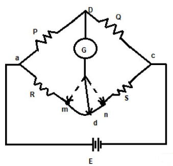
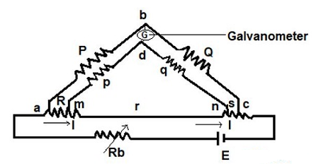

<head>

</head>

### Introduction

A kelvin bridge or kelvin double bridge is a modified version of the Wheatstone bridge, which can measure resistance values in the range between 1 to 0.00001 ohms with high accuracy. It is named because it uses another set of ratio arms and a galvanometer to measure the unknown resistance value. The basic operation of the Kelvin double bridge can be understood from the basic construction and operation of the kelvin bridge. 

### Principle of Kelvin Bridge 
A Wheatstone bridge is used to measure resistance equal to or greater than 1 ohm, but if we want to measure the resistance below 1 ohm, it becomes difficult because the leads which are connected to the galvanometer adds up the resistance of the device along with the resistance of leads leading to variation in the measurement of the actual value of resistance. Hence, In order to overcome this problem, we can use a modified bridge called kelvin bridge. 

### Derivation for Finding Unknown Resistance Value
&nbsp;&nbsp;&nbsp;&nbsp;&nbsp;&nbsp;&nbsp;&nbsp;&nbsp;&nbsp;&nbsp;The Kelvin bridge is of resistance “r” which connects “R” ( unknown resistor ) to standard resistor “S”. The resistance value can be viewed in the galvanometer (from “m to n”). If the pointer in the galvanometer shows at “m”. It means, the resistance value is less and if the pointer shows at “n” means the resistance value is high. Hence rather by connecting galvanometer to “ m and n “ we choose another intermediate point “d” in kelvin bridge as shown in Fig. 1

**Fig. 1 Kelvin Bridge**

The value of resistance can be calculated as follows:

$$\frac{r_1}{r_2} = \frac{P}{Q}……(1)$$ 

$$R + r_1 = \frac{P}{Q} * (S+r_2)$$   

$$\frac{r_1}{r_1 + r_2} = \frac{P}{P+Q}$$

We know that, 

$$r = r_1 + r_2$$ 

$$r_1 = \frac{P}{P+Q}.r$$

$$r_2 = \frac{Q}{P+Q}.r$$ 

$$R + \frac{P}{( P + Q)} * r = \frac{P}{Q} \left (S + \frac{Q}{P+Q}*r \right ) $$

$$R = \frac{P}{Q}*S…… (2)$$  

From the above equation, we can say that by connecting the galvanometer at point “d” there will be no effect in the measurement of the actual resistance value, but the only disadvantage of this process is that it is difficult to implement, hence we use a Kelvin double bridge for getting accurate low resistance value.

###  Kelvin Double Bridge
&nbsp;&nbsp;&nbsp;&nbsp;&nbsp;&nbsp;&nbsp;&nbsp;&nbsp;&nbsp;&nbsp;&nbsp;The construction of Kelvin double bridge is similar to the wheatstone bridge, but the only difference is it consists of 2 arms “P & Q”, “p & q” where the arm “p & q” is connected to one end of the galvanometer, at “d” and “P & Q” is connected to another end of the galvanometer, at ‘b’. This connection minimizes the effect of connecting lead and the unknown resistor R & a standard resistor S is placed between ” a and m”, and “n and c” respectively.
 

 

 

**Fig. 2 Kelvin double bridge circuit**

### Derivation 
The ratio of p/q is made equal to the P/Q. Under balance condition zero current flows through the galvanometer. The potential difference between the point a and b is equivalent to the voltage drop between the points Eamd.

$$E_{ab} = \frac{P}{P+Q}  E_{ac}$$

$$E_{ac} = I \left [ R + S + \frac{( p+q)r}{p+q+r} \right ]……(3)$$ 

$$E_{amd} = I \left [ R + \frac{p}{p+q} * {\frac{(p+q)r}{(p+q+r)}} \right ]$$

$$E_{ac} = I \left [ \frac {pr} {p+q+r} \right ]………(4) $$

For zero galvanometer deflection,

$$\frac{P}{P+Q}*I \left [ R + \frac{p}{p+q} * {\frac{(p+q)r}{(p+q+r)}} \right ] = I \left [ \frac {pr} {p+q+r} \right ]$$

$$R = \frac {P}{Q}* S + \frac {pr}{p+q+r} \left [ \frac{P}{Q} – \frac{p}{q} \right ].....(5) $$ 

As we know that, 

$$\frac{P}{Q} = \frac{p}{q}$$ 

Then equation (5) becomes

$$R = \frac{P}{Q} * S…… (6) $$ 

The above equation is the working equations of the Kelvins bridge. The equation shows that the result obtains from the Kelvin double bridge is free from the impact of the connecting lead resistance. 

For obtaining the appropriate result, it is very essentials that the ratio of their arms is equal. The unequal arm ratio causes the error in the result.  Also, the value of resistance r should be kept minimum for obtaining the exact result and the thermo-electric electromagnetic field induced in the bridge while taking readings can be reduced by interchanging the polarity of the connection. Therefore, the unknown resistance value can be obtained from the two arms. Typically, it measures 1 – 0.00001 ohm with an accuracy ± 0.05% to ±0.2%, in order to achieve sensitivity the current to be supplied should be large.

### Advantages of Kelvin Double Bridge

* It can measure the resistance value in the range of 0.1 µA to 1.0 A.
* Power consumption is less.
* Simple in construction.
* Sensitivity is high.

### Disadvantages of Kelvin Double Bridge
* For knowing whether the bridge is balanced or no, the sensitive galvanometer is used.
* To obtain good sensitivity of the device, a high current is required.
* Manual adjustments are to made periodically when required. 

### Application of Kelvin Double Bridge
* It is used to measure the unknown resistance of a wire.

